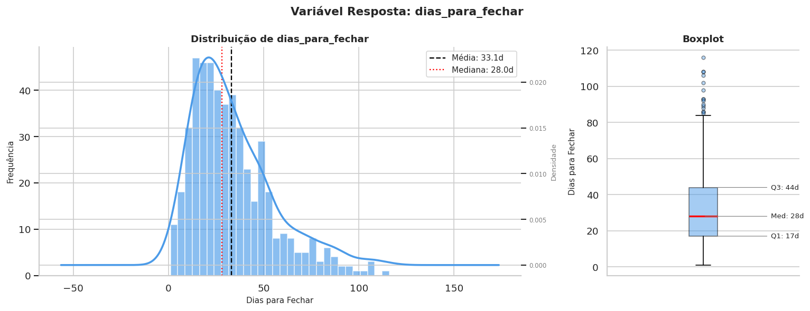
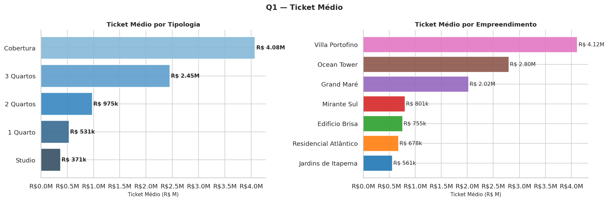
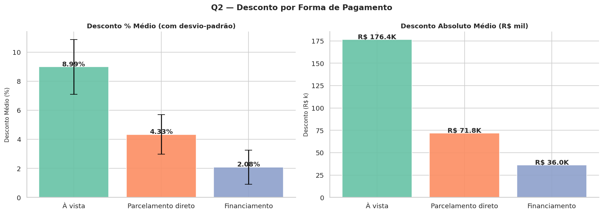
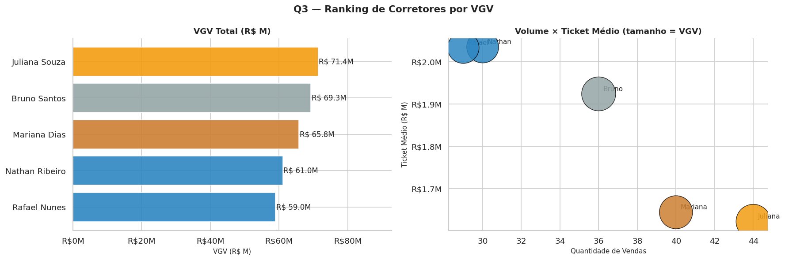
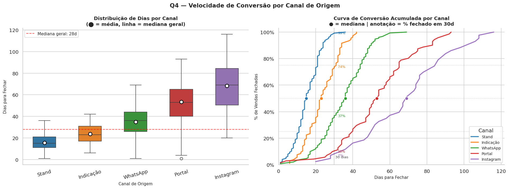
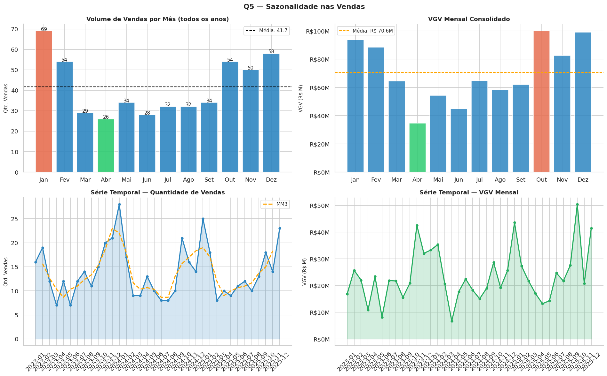
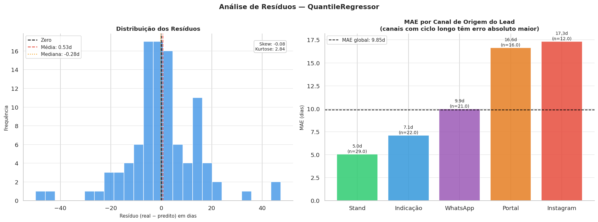

# 🏢 Análise e Previsão de Ciclo de Vendas Imobiliárias

<p align="center">
  
  
  
  
</p>

<p align="center">
  Análise de Dados + Modelo preditivo + API REST para estimar quantos dias uma imobiliária levará para fechar uma venda,
  com base em canal de origem do lead, perfil do imóvel, corretor e sazonalidade.
</p>

---

## 📋 Índice

1. [Contexto do Problema](#-contexto-do-problema)
2. [Análise Exploratória — Perguntas de Negócio](#-análise-exploratória-e-principais-insights)
3. [Modelagem](#-modelagem)
4. [Resultados](#-resultados)
5. [Estrutura do Projeto](#-estrutura-do-projeto)
6. [Como Executar](#-como-executar)
7. [API — Endpoints](#-api--endpoints)
8. [Testes](#-testes)

---

## 🎯 Contexto do Problema

Uma incorporadora imobiliária com 7 empreendimentos ativos em Itapema, Balneário Camboriú e Porto Belo precisa entender e prever o tempo que cada venda leva para ser fechada após o primeiro contato com o lead.

**Variável alvo:** `dias_para_fechar` — número de dias entre o primeiro contato e a assinatura do contrato.

---
<a id="analise"></a>
## 📈 Análise Exploratória e Principais Insights


### Distribuição da variável alvo

  

A distribuição é assimétrica à direita (skew = 1,15): a maioria das vendas fecha entre 15 e 44 dias (Q1–Q3), mas há uma cauda de negociações longas chegando a 116 dias. Isso motivou o uso de **MAE** como métrica principal e **QuantileRegressor** como modelo.

---

### Q1 — Ticket Médio por Tipologia e Empreendimento



#### Por Tipologia

| Tipologia | Vendas | Ticket Médio | VGV Total |
|-----------|:------:|:------------:|----------:|
| Cobertura | 81 | **R$ 4,08M** | R$ 330,3M |
| 3 Quartos | 119 | R$ 2,45M | R$ 292,0M |
| 2 Quartos | 161 | R$ 975k | R$ 157,0M |
| 1 Quarto | 102 | R$ 531k | R$ 54,2M |
| Studio | 37 | R$ 371k | R$ 13,7M |

#### Por Empreendimento

| Empreendimento | Vendas | Ticket Médio | VGV Total |
|---------------|:------:|:------------:|----------:|
| Villa Portofino | 79 | **R$ 4,12M** | R$ 325,2M |
| Ocean Tower | 62 | R$ 2,80M | R$ 173,7M |
| Grand Maré | 73 | R$ 2,02M | R$ 147,6M |
| Mirante Sul | 71 | R$ 801k | R$ 56,9M |
| Edifício Brisa | 77 | R$ 755k | R$ 58,1M |
| Residencial Atlântico | 71 | R$ 678k | R$ 48,1M |
| Jardins de Itapema | 67 | R$ 561k | R$ 37,6M |

📌 O ticket médio cresce de forma consistente com o tamanho da unidade — de R$ 371k para Studios até R$ 4,08M para Coberturas, uma diferença de **11x**. Coberturas e 3 Quartos representam apenas 40% das vendas, mas concentram **74% do VGV total** (R$ 622M de R$ 847M).

---

### Q2 — Taxa de Desconto por Forma de Pagamento



| Forma de Pagamento | Vendas | Desconto % Médio | Desvio Padrão | Desconto Abs. Médio | Desconto Total |
|-------------------|:------:|:----------------:|:-------------:|:-------------------:|:--------------:|
| **À vista** | 63 | **8,99%** | ±1,88% | R$ 176k | R$ 11,1M |
| Parcelamento direto | 154 | 4,33% | ±1,36% | R$ 72k | R$ 11,1M |
| Financiamento | 283 | 2,08% | ±1,17% | R$ 36k | R$ 10,2M |

📌 Vendas à vista recebem em média **4,3x mais desconto** que vendas por financiamento (8,99% vs. 2,08%). O alto desvio padrão do desconto à vista (±1,88%) indica ausência de política clara — cada corretor negocia de forma independente para esse perfil de comprador.

📌 O desconto total concedido ao longo do período foi de **R$ 32,4M** — equivalente a 3,8% do VGV total, ou praticamente 4 meses de VGV médio mensal desperdiçados em concessões.

---

### Q3 — Top 5 Corretores por VGV



| # | Corretor | Vendas | VGV Total | Ticket Médio | Dias (mediana) | Desconto |
|---|----------|:------:|----------:|:------------:|:--------------:|:--------:|
| 🥇 | Juliana Souza | 44 | **R$ 71,4M** | R$ 1,62M | 25 dias | 4,2% |
| 🥈 | Bruno Santos | 36 | R$ 69,3M | R$ 1,92M | 30 dias | 3,5% |
| 🥉 | Mariana Dias | 40 | R$ 65,8M | R$ 1,64M | 32 dias | 3,2% |
| 4 | Nathan Ribeiro | 30 | R$ 61,0M | R$ 2,03M | 30 dias | 3,6% |
| 5 | Rafael Nunes | 29 | R$ 59,0M | R$ 2,03M | 29 dias | 3,8% |

📌 Os top 5 concentram **R$ 326,5M** — 38,5% do VGV total com apenas 33% dos corretores. Dois perfis complementares de alta performance se destacam:

**Perfil A — Alto Volume** (Juliana, Mariana): mais negócios com tickets menores, fechamento rápido. Juliana tem o menor ciclo mediano do grupo (25 dias) — alta eficiência operacional.

**Perfil B — Alto Ticket** (Nathan, Rafael): menos negócios, mas com maior valor unitário (R$ 2,03M) e os menores descontos do grupo, sugerindo maior poder de negociação e especialização em Alto Padrão.

---

### Q4 — Distribuição de Dias para Fechar por Canal de Origem



| Canal | Qtd | Mediana | Média | % em 15d | % em 30d | % em 45d |
|-------|:---:|:-------:|:-----:|:--------:|:--------:|:--------:|
| **Stand** | 127 | **15 dias** | 15,5d | 53,5% | **99,2%** | 100% |
| Indicação | 107 | 23 dias | 23,7d | 22,4% | 73,8% | 100% |
| WhatsApp | 152 | 36 dias | 34,9d | 4,6% | 36,8% | 78,9% |
| Portal | 71 | 53 dias | 53,4d | 2,8% | 9,9% | 31,0% |
| **Instagram** | 43 | **69 dias** | 68,2d | 0,0% | 7,0% | 16,3% |

📌 **A origem do lead é o fator mais determinante do ciclo de venda** — com diferença de 54 dias entre o canal mais rápido (Stand, 15d) e o mais lento (Instagram, 69d).

📌 A curva ECDF revela padrões distintos: Stand tem curva quase vertical antes dos 30 dias (99,2% fecham em até 1 mês), enquanto Instagram tem distribuição espalhada ao longo de todo o período — leads digitais chegam com baixo comprometimento e alta variância comportamental.

📌 WhatsApp, apesar do ciclo intermediário (36d), é o canal de **maior volume** (152 vendas, 30% do total), com espaço para melhora via qualificação de leads mais ativa no CRM.

---

### Q5 — Sazonalidade nas Vendas



| Mês | Vendas | Índice Sazonal | VGV | Classificação |
|-----|:------:|:--------------:|----:|:---:|
| Janeiro | 69 | **1,66** | R$ 93,6M | 🔴 Pico máximo |
| Dezembro | 58 | 1,39 | R$ 99,2M | 🟠 Alta temporada |
| Outubro | 54 | 1,30 | R$ 99,9M | 🟠 Alta temporada |
| Fevereiro | 54 | 1,30 | R$ 88,4M | 🟠 Alta temporada |
| Novembro | 50 | 1,20 | R$ 82,6M | 🟡 Acima da média |
| Setembro | 34 | 0,82 | R$ 62,1M | 🔵 Abaixo da média |
| Maio | 34 | 0,82 | R$ 54,3M | 🔵 Abaixo da média |
| Julho | 32 | 0,77 | R$ 64,8M | 🟣 Baixa temporada |
| Agosto | 32 | 0,77 | R$ 58,4M | 🟣 Baixa temporada |
| Março | 29 | 0,70 | R$ 64,4M | 🟣 Baixa temporada |
| Junho | 28 | 0,67 | R$ 44,8M | 🟣 Baixa temporada |
| Abril | 26 | **0,62** | R$ 34,6M | 🟢 Vale mínimo |

## 🤖 Modelagem

### Decisões de feature engineering

| Transformação | Features | Justificativa |
|--------------|----------|---------------|
| `log1p` | `valor_tabela` | Skew = 1,33 e amplitude 26x → compressão logarítmica necessária |
| Cyclic encoding (`sin`/`cos`) | `mes`, `trimestre` | Preserva continuidade temporal (Dez→Jan é próximo, não distante) |
| Ordinal encoding | `tipologia` | Ordem natural: Studio < 1Q < 2Q < 3Q < Cobertura |
| Smoothed target encoding (α=5) | `corretor`, `imobiliaria` | Muitas categorias; shrinkage evita overfitting em grupos pequenos |
| One-Hot encoding | `origem_lead`, `empreendimento` | Sem ordem natural entre categorias |
| `RobustScaler` | `area_m2`, `valor_log` | Outliers confirmados nos boxplots |
| `StandardScaler` | target encodings | Distribuição simétrica pós-smoothing; necessário para regularização equilibrada |
| `MinMaxScaler` | `ano`, `tipologia_ord` | Range fixo e conhecido; preserva ordenação em [0,1] |

### Features descartadas (e por quê)

| Feature | Motivo |
|---------|--------|
| `valor_venda`, `desconto_pct` | ⚠️ **Data leakage** — só existem após a venda ser fechada |
| `cidade` | Redundante com `empreendimento` (cada empreendimento é de uma única cidade) |
| `id_venda`, `data_venda` | Substituídas por features derivadas; sem poder preditivo direto |

### Split temporal

```
Treino: Jan/2023 → Jun/2025  →  400 amostras (80%)
Teste : Jun/2025 → Dez/2025  →  100 amostras (20%)
```

> **Por que temporal e não aleatório?** Usar shuffle em dados temporais introduz leakage: o modelo veria vendas "do futuro" durante o treino, inflando artificialmente as métricas.

---

## 📊 Resultados

### Comparação de modelos (conjunto de teste — 100 amostras)

| Modelo | MAE | RMSE | R² | vs Baseline |
|--------|-----|------|-----|-------------|
| **QuantileReg (tuned)** | **9,85 dias** | 14,22 | 0,6016 | **+0,14 dias** ✅ |
| QuantileReg (default) | 9,85 dias | 14,22 | 0,6015 | +0,14 dias |
| ExtraTrees (default) | 9,95 dias | 14,02 | 0,6130 | +0,04 dias |
| **Baseline — média/canal** | 9,99 dias | 13,79 | 0,6255 | — |
| RandomForest (tuned) | 10,09 dias | 13,89 | 0,6201 | −0,10 dias |
| GradientBoosting (tuned) | 10,16 dias | 14,08 | 0,6096 | −0,17 dias |
| Ridge | 10,27 dias | 14,42 | 0,5906 | −0,28 dias |
| XGBoost | 10,57 dias | 14,90 | 0,5629 | −0,58 dias |
| LightGBM | 10,79 dias | 15,14 | 0,5488 | −0,80 dias |

### Modelo final: `QuantileRegressor(quantile=0.5, alpha=0.000593)`

```
MAE   =  9,85 dias    ← erro médio absoluto
RMSE  = 14,22 dias
R²    =  0,6016       ← explica 60% da variância
```

### Performance por canal (MAE no conjunto de teste)

| Canal | MAE | n | Interpretação |
|-------|-----|---|---------------|
| **Stand** | **5,0 dias** | 22 | Ciclo homogêneo e previsível ✅ |
| **Indicação** | **7,1 dias** | 22 | Previsível ✅ |
| WhatsApp | 9,9 dias | 21 | Aceitável |
| Portal | 16,4 dias | 19 | Alta variância ⚠️ |
| Instagram | 17,7 dias | 16 | Difícil de prever ⚠️ |




### Interpretação dos resultados

O modelo **erra em média ~10 dias** ao estimar o ciclo de uma venda. Para contexto:

- Para **Stand e Indicação** (44% das vendas), o erro é menor que 1 semana — útil operacionalmente.
- Para **Portal e Instagram**, a variância intrínseca do lead digital não está capturada pelas features disponíveis.
- O dataset tem um **teto informacional real**: sem dados de CRM (número de interações, visitas, tempo de resposta), dificilmente o MAE cai abaixo de ~8 dias.

> O modelo não é fraco — **o dataset tem baixo poder preditivo além do canal de origem**. O modelo aprende distinções dentro de cada canal e supera o baseline em MAE. A conclusão mais valiosa é justamente essa: para melhorar a previsão, precisa enriquecer o dataset com dados comportamentais.

---

## 📁 Estrutura do Projeto

```
previsao_ciclo_vendas/
│
├── 📂 data/
│   └── vendas_imoveis.csv          ← dataset original
│
├── 📂 models/                      ← artefatos gerados por train.py
│   ├── model.pkl                   ← QuantileRegressor tunado
│   ├── scaler.pkl                  ← ColumnTransformer
│   ├── te_corretor.pkl             ← dict smoothed target encoding
│   ├── te_imobiliaria.pkl          ← dict smoothed target encoding
│   └── ohe_metadata.pkl            ← colunas OHE + global means
│
├── 📂 notebooks/
│   └── Notebook.ipynb        ← análise completa (EDA + SQL + Modelagem)
│
├── 📂 src/
│   ├── train.py                    ← treina e serializa todos os artefatos
│   ├── pipeline.py                 ← classe VendasPipeline (preprocessing + predict)
│   └── api.py                      ← FastAPI (endpoints + schemas Pydantic)
│
├── 📂 tests/
│   └── test_api.py                 ← testes manuais e pytest
│
├── 📂 img/                         ← prints dos gráficos do notebook
│
├── .gitignore
├── requirements.txt
└── README.md
```

---

## Como Executar


> **📓 Por onde começar:** O coração deste projeto é o notebook `notebooks/Notebook.ipynb`.
> É lá que estão toda a análise exploratória, as respostas às perguntas de negócio, a query SQL,
> as decisões de modelagem e os resultados do modelo com visualizações e raciocínio documentados
> em cada etapa. **Se você quer entender o projeto, comece pelo notebook.**
>
> A API (`src/api.py`) é um entregável complementar: ela serve o modelo treinado em um endpoint
> REST para simulação de deploy, mas não substitui a análise. Ela só funciona após executar
> `src/train.py`, que reproduz o pipeline do notebook e serializa os artefatos.

### 1 — Explorar a análise (recomendado)

```bash
# Instale as dependências
pip install -r requirements.txt

# Abra o notebook
jupyter notebook notebooks/Notebook.ipynb
```

### 2 — Executar a API (opcional)

```bash
# Ambiente virtual
python -m venv .venv && source .venv/bin/activate
pip install -r requirements.txt

# Gera os artefatos .pkl a partir do pipeline do notebook
python src/train.py

# Sobe a API
uvicorn src.api:app --reload --port 8000
```

---

## 🔌 API — Endpoints

### `GET /health`
```json
{"status": "ok", "modelo": "QuantileRegressor", "artefatos": "carregados"}
```

### `POST /predict`
```bash
curl -X POST http://localhost:8000/predict \
  -H "Content-Type: application/json" \
  -d '{"data_venda":"2025-03-15","empreendimento":"Grand Maré",
       "tipologia":"2 Quartos","area_m2":72.5,"valor_tabela":650000,
       "forma_pagamento":"Financiamento","corretor":"Juliana Souza",
       "imobiliaria":"Prime Realty","origem_lead":"WhatsApp"}'
```
```json
{"dias_previsto": 34, "intervalo_inf": 27, "intervalo_sup": 48, "canal": "WhatsApp"}
```

### `POST /predict/batch`
Até 5.000 vendas por requisição, ordenadas por `dias_previsto`.

📖 **Swagger UI:** `http://localhost:8000/docs`

---

## 🧪 Testes

```bash
python tests/test_api.py      # modo manual com prints
pytest tests/test_api.py -v   # modo pytest
```

---


## 👤 Autor

Desenvolvido por Bruno Nazario Alves
